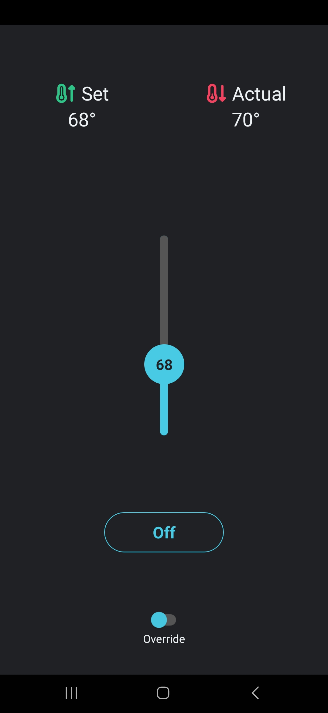
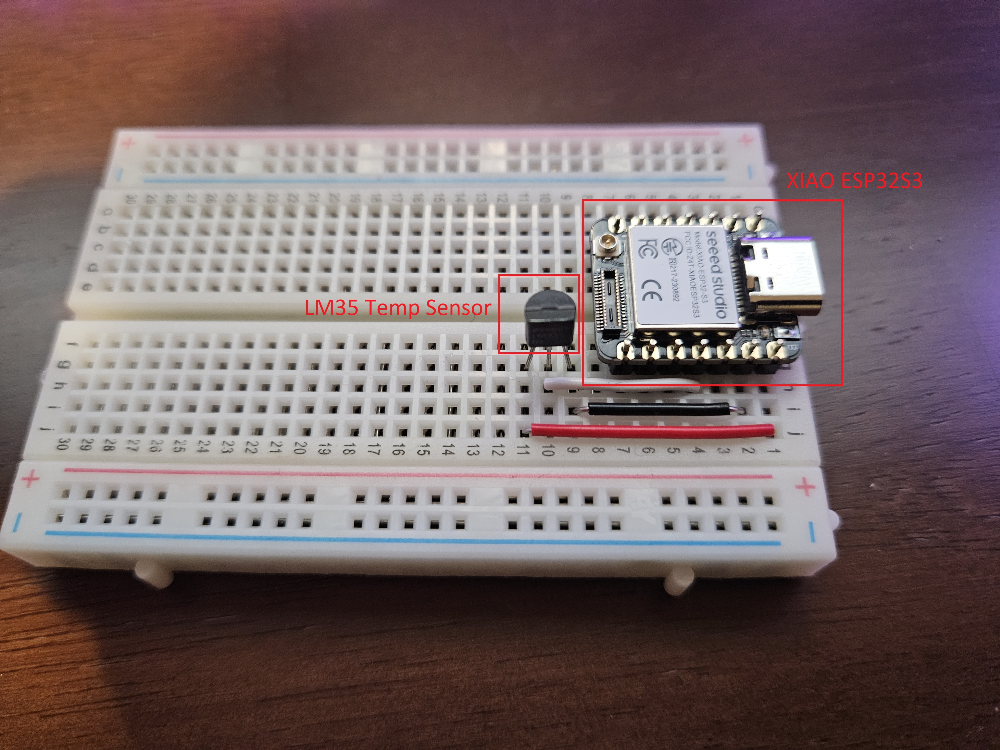
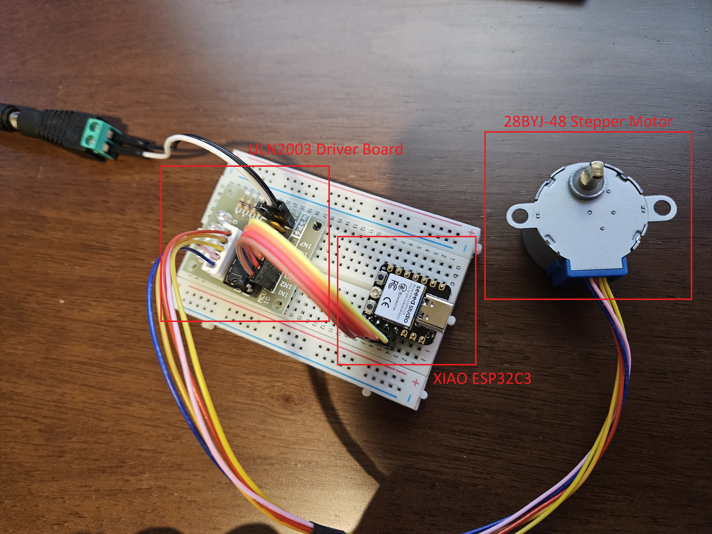
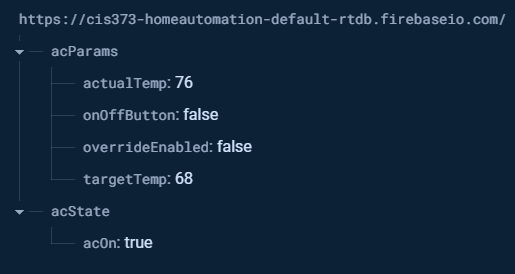

## About The Project

This Home Automation Smart Switch is an IoT project consisting of four main components:

- A React Native Mobile App
- Firebase Real-Time Database
- An ESP32 microcontroller temperature node
- An ESP32 microcontroller motor controller node

The React Native mobile application is used to view the current home ambient temperature, set a desired target temperature for the air conditioner to cool to, and to override the controller and just turn the air conditioner on until override is revoked.

The Firebase Real-Time Database is used to store the state of the air conditioner motor controller and allow access remotely (for when I'm not home and want to cool the house down on my way home).

The ESP32 microcontroller that acts as a temperature node has a single EM32 termerature sensor attached to it and some code to continuously monitor air temperature. The temp sensor is cheap and sporatic, so to compensate for this we poll the temperature every second for 60 seconds, then average this out and write it off to the Firebase RTDB.

The second ESP32 microcontroller that acts as the motor controller node checks the Firebase RTDB every 5 seconds (for demonstration purposes, could be changed to 30 seconds after presentation) and checks a number of conditions to either turn on the AC, turn off the AC, or leave it alone. If the override switch is engaged then it does whatever the On/Off button is set to. Otherwise, it checks if the set temperature is lower than the actual temperature and acts accordingly.

<p align="center">
  
</p>

## Technologies Built With

- React Native Mobile Application
  - Configuring, monitoring, overriding
- Firebase Real-Time Database
  - Config
  - Logging
- XIAO ESP32S3 Microcontroller
  - Temp node
  - LM35 Temperature Sensor
- XIAO ESP32C3 Microcontroller
  - Motor controller node
  - 28BYJ-48 Stepper Motor
  - ULN2003 Driver Board

## Installation

### React Native Mobile Application

1. Clone the repo
   ```sh
   git clone https://github.com/dustinecker12/HomeAutomation.git
   ```
2. CD into home directory
   ```sh
   cd home-automation
   ```
3. Install NPM packages
   ```sh
   npm install
   ```
4. Start Metro app to test on emulator
   ```js
   npx expo start
   ```
5. With an Android emulator or iOS simulator installed, press a for Android or i for iOS.
6. Or install Expo CLI tools to build application and install on a physical device.

### ESP32 Microcontrollers

1. Download both files from esp32-nodes folder
2. Open both files in Arduino IDE
3. Connect both ESP32 microcontrollers to your PC
4. Flash one program onto each board.

## Screenshots & Images

### Temp Node

<p align="center">
  
</p>

### Motor Node

<p align="center">
  
</p>

### Database Design

<p align="center">
  
</p>

## Demo Video

Click image for a demo video.

<p align="center">
  <a href="https://youtu.be/gS7A_wTXkDc">
    
  </a>
</p>
